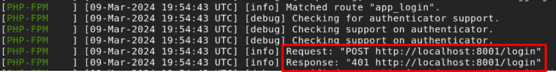
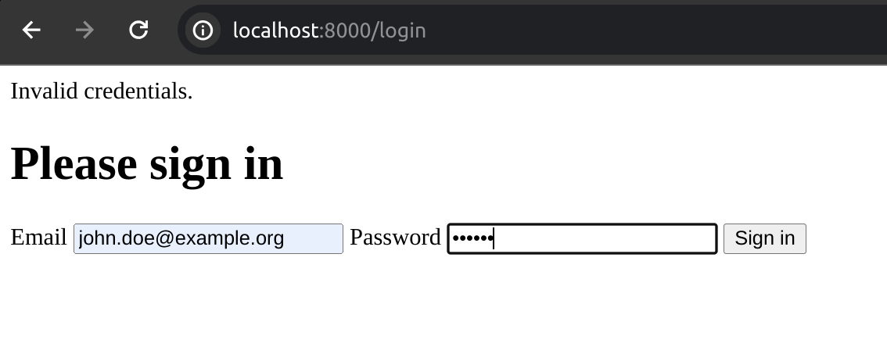
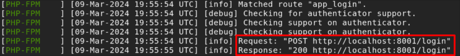
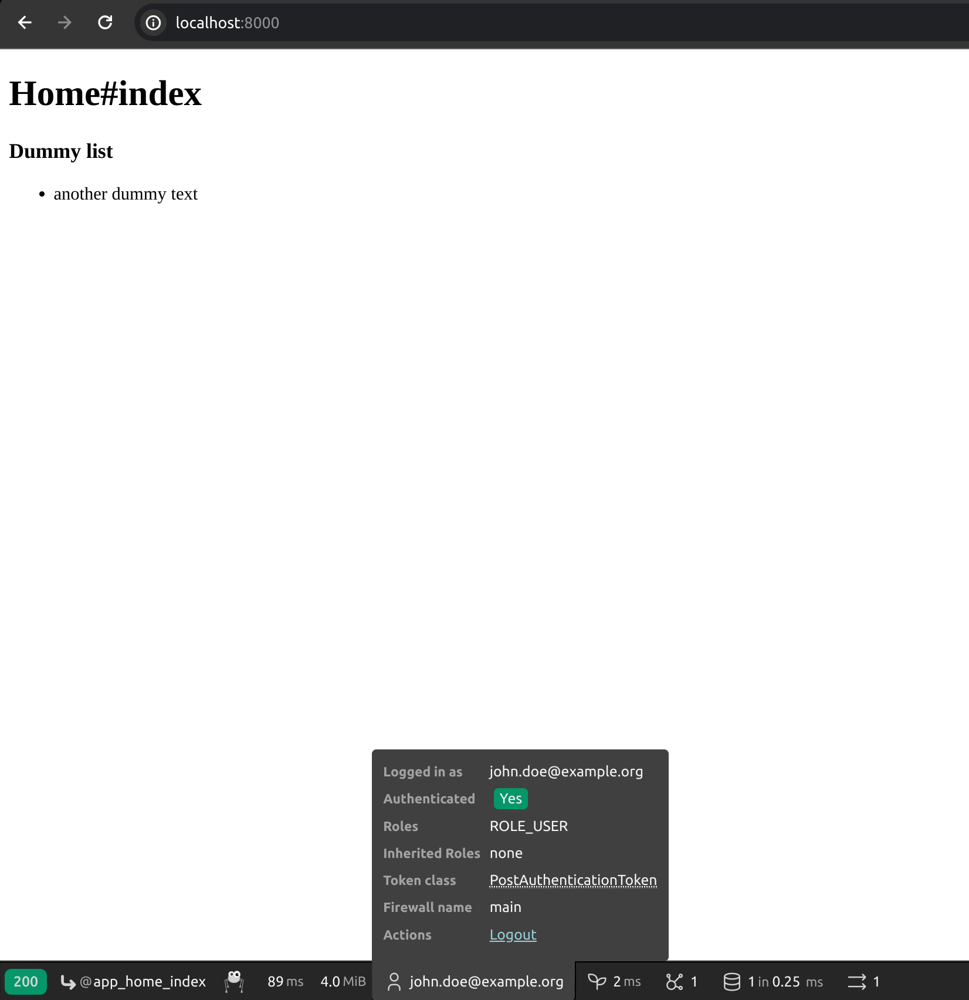
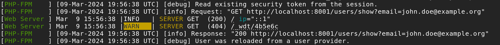

# Remote login tutorial

Imagine you have the following scenario:

* Having 2 Symfony apps deployed in different domains or subdomains (e.g. `users.example.com` & `website.example.com`).
* You have to login using the first app but there is not persisted users in this one. The users, required for the authentication
process, are located in the second one.
* Once you logged in the first app, any time this app needs to refresh the session user (e.g. every time a protected page is loaded).

How do you achieve that the first app communicates with the second to handle the authentication/user refresher process in a fluid way?

Well, this is where writing a **custom authenticator** and a **custom user provider** come handy.

This is my proposal about how to handle this scenario. Possibly, there are other ways (maybe easier), but this is the mine one.

The stack used for this implementation is:
**Symfony 7.0.5** + **PHP 8.2** + **Sqlite 3.43**.

## Setup the environment

You have to run the following commands for both apps:
```
- composer install
- symfony console doctrine:database:create
- symfony console doctrine:migrations:migrate
- symfony console doctrine:fixtures:load
```

Then you have to execute a web server. Here, I used the Symfony server:

### Application #1 - website.example.com
```
symfony server:start --no-tls --port=8000 -d
```

### Application #2 - users.example.com
```
symfony server:start --no-tls --port=8000 -d
```

If you want to use your own webserver remember, set different domains/subdomains for each app, or set different ports for them,
you have to customize the env var `REMOTE_AUTH_HOST`, located in the app #1 to set the domain of the app that contains
the users:

```dotenv
REMOTE_AUTH_HOST=http://localhost:8001
```
Set the var according your specific scenario.

#### Remember, The code is intended to be used locally. It is not production ready!

## App #2: Where the users live! - users.example.com

This App will expose 2 endpoints:

* Authenticate user:
```
POST http://localhost:8001/login
```
In the payload you'll pass the credentials:
```json
{
  "email": "john.doe@example.org",
  "password": "123456"
}
```
The following HTTP codes are returned:
- If authentication fails: `HTTP 401`
- If authentication is ok: `HTTP 200`

This request will be called when the Login process is performed in the App #1

* Refresh user:

```
GET http://localhost:8001/users/show?email=<the-user-email-requested>
```
This request will be called every time Symfony requires to refresh the session user.

The following HTTP codes are returned:
- If authentication fails: `HTTP 404`
- If authentication is ok: `HTTP 200`

Please the code under `users.example.com` folder in order to hava a full understanding
about how these endpoints have been implemented.

## App #1: Where the remote users are requested - website.example.com

Here you need to write a custom authenticator in order to tell Symfony where to look users to
perform the authentication process:

```php
<?php

//...

class RemoteUserAuthenticator extends AbstractLoginFormAuthenticator
{
    final public const LOGIN_ROUTE_NAME = 'app_login';
    final public const HOME_ROUTE_NAME = 'app_home_index';

    public function __construct(
        private readonly RemoteAuthenticatorService $remoteAuthenticatorService,
        private readonly UrlGeneratorInterface $urlGenerator
    ) {
    }

    public function supports(Request $request): bool
    {
        $route = $request->attributes->get('_route');

        return (self::LOGIN_ROUTE_NAME === $route) && $request->isMethod('POST');
    }

    public function authenticate(Request $request): SelfValidatingPassport
    {
        $userIdentifier = $request->get('_username');
        $password = $request->get('_password');
        $csrfToken = $request->get('_csrf_token');

        $userBadge = new UserBadge($userIdentifier, function (string $email) use ($password) {
            $user = $this->remoteAuthenticatorService->execute($email, $password);

            if (!$user) {
                throw new UserNotFoundException();
            }

            return $user;
        });

        return new SelfValidatingPassport($userBadge, [
            new CsrfTokenBadge('authenticate', $csrfToken)
        ]);
    }

    // ... 
}
```
As you can see, the authenticator gets the user's credentials and pass them to the `remoteAuthenticatorService` where
the authentication request is performed.

About the service used to refresh the session user, you have to implement a custom `UserProvider`:

```php
readonly class RemoteUserProvider implements UserProviderInterface
{
    public function __construct(private RemoteUserFetcherService $remoteUserFetcherService)
    {
    }

    public function refreshUser(UserInterface $user): UserInterface
    {
        if (!$user instanceof User) {
            throw new UnsupportedUserException(sprintf('Invalid user class "%s".', get_class($user)));
        }

        return $this->remoteUserFetcherService->execute($user->getUserIdentifier());
    }

    public function supportsClass(string $class): bool
    {
        return User::class === $class || is_subclass_of($class, User::class);
    }

    public function loadUserByIdentifier(string $identifier): UserInterface
    {
        return $this->remoteUserFetcherService->execute($identifier);
    }
}
```
As you can see, the provider call the request `POST /login` every time Symfony requires to refresh the session user.

Finally you have to set up a couple of things in the `security.yaml` in order to tell Symfony to use the custom authenticator and
the custom user provider:

* Set the custom provider:
```yaml
security:
  #...
  providers:
    app_user_provider:
      id: App\Security\RemoteUserProvider
  #...
```

* Set the custom authenticator:
```yaml
security:
  #...
    main:
      lazy: true
      provider: app_user_provider
      form_login:
        login_path: app_login
        check_path: app_login
        enable_csrf: true
      logout:
        path: app_logout
        target: app_login
      custom_authenticators:
        - App\Security\RemoteUserAuthenticator
      entry_point: App\Security\RemoteUserAuthenticator
  #...
```
And that's it!

When the users perform a login in the App #1, you can see how Symfony uses the authenticator defined to perform the remote auth:

* Failed authentication




* Authentication succeeded:




* Every time that Symfony needs to refresh the session user, it uses the custom service provider to accomplish it. The
refreshed user is returned from the remote app:



And that's it!

Please, review the code in the folder `website.example.com` in order to have a full understanding about
the implementation here described!

I hope you like what I've done. If so, please leave a comment. If you think I could do the things in a different (and easier) way, please leave a comment. I would appreciate it.

Thanks so much!,

Cobis
